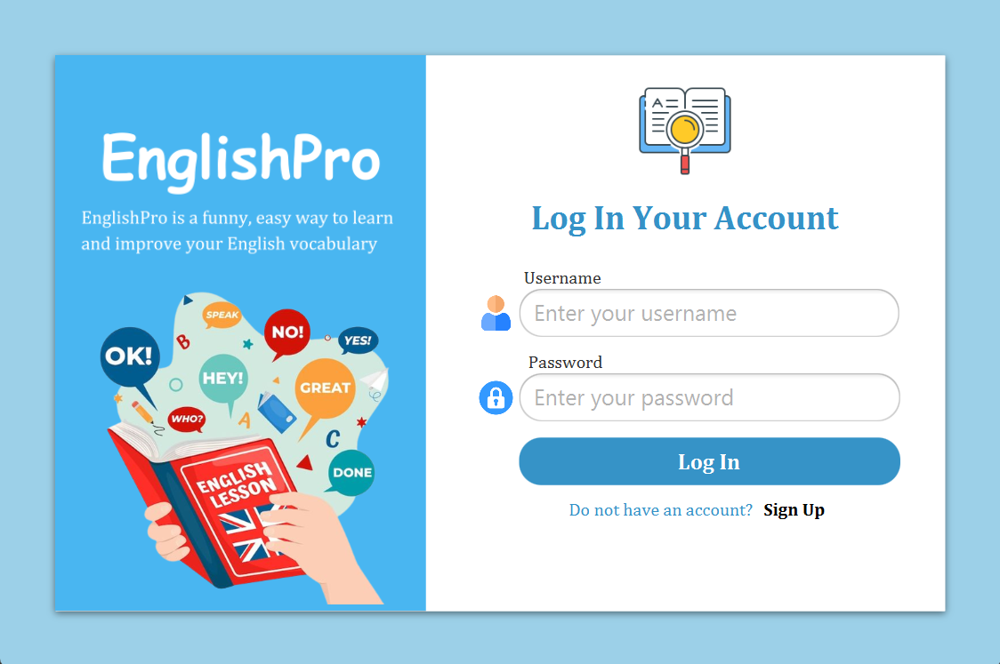
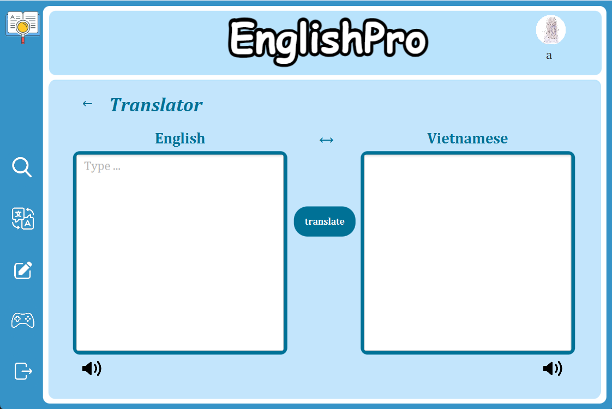

# Application of English learning using Java
Object-Oriented Programming - INT2204 1

---
## ***Author***
Group 13:
- Nguyen Khanh Linh - 22021158
- Luong Thi Hao - 22021187

## ***Description***
This application is designed to support English learning. It is wwritten in Java programming language and ulitizes the JavaFX graphics library.
- The application follows the MVC model.
- It reads data from E_V.txt file to translate vocabulary and uses Google Translate API for text translation.
- In addtion to language translation, the application includes a flashcard review and self-practice exercises.
- It also integrates various vocabulary games that both fun and educational.

## ***UML Diagrams***
You can download the diagram at the following path .

## ***Installation***
1. Clone the project from the repository
2. Open project in IDE (recommend intelliJ IDEA)
3. Run the project

## ***Usage***
1. Use the registered account to log in to the application. If you don't have an account or forgot your account, please register with a new username and password.
2. The Search section is installed in Vietnamese-English dictionary
- Enter the word in the search_box and click the word to search in the list shown, then the right side of the window will display the meaning of the word.
- Click `Add` button to add the word to NotedWord list (`plus` icon)
- Click `Pronounce` button to hear the word's pronunciation (`speaker` icon)
3. In Translator section, enter the text to translated then press the Translate button to translate. Languages can be swapped by pressing 2-way arrow pen. You can hear pronounce the text by press `Speaker` button.
4. You can review the noted words in the Practice section.
- Click `Noted Words` button to review the noted words list. In this interface, you can add new word to list by press `Add` button. To delete a word from list, you can click `Delete` button and to edit the meaning of a word, you can click `Edit` button.
- Click `Flashcards` button to review the noted words by flashcards, you can click `Edit` button to edit the meaning of the word.
- Click `Exercises` button to practice your noted words by do multiple-choice quizzes.
5. Besides studying, you can entertain with vocabulary games in the Games button. Here we develop 3 games about vocabulary for studying English.
- In Hang Man game, you will guess words by enter characters.
- In Word Bubbles game, you will enter the words with given prefix in limited time.
- In Word Snatchers game, you will arrange the letters into English words with given explanations. Then completed the game, you can add these words of the game to noted words list if you want to review after.

## ***Demo***
Link demo https://drive.google.com/file/d/12AyYxLo1GQ6Ztd1sVu9aKyr2Y96h4jdx/view?usp=sharing

## ***Future improvements***
- Add multi-user mode
- Add dictionary of many other languages and synonyms-antonyms
- Use databases to store data
- Integrate the application with API of Google Speech to convert speech to text
- Develop more complex games
- Expand exercises section and review knowledge

## ***Contribution***
If you have any contributions to the application or encounter difficulties while using the app, please create a Pull request or report a new issue. Thank you very much for your interest in the app, and I wish you have enjoyable moments with this app.

## ***Project Status***
The project is completed.

---
---
